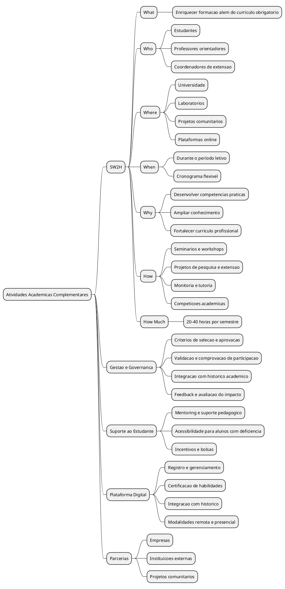

# 5W2H - Atividades Acadêmicas Complementares

## What (O quê?)
Atividades acadêmicas complementares que enriquecem a formação estudantil além do currículo obrigatório.

## Who (Quem?)
Estudantes, professores orientadores e coordenadores de extensão.

## Where (Onde?)
Universidade, laboratórios, projetos comunitários e plataformas online.

## When (Quando?)
Durante o período letivo, com cronograma flexível conforme disponibilidade.

## Why (Por quê?)
Desenvolver competências práticas, ampliar conhecimento e fortalecer o currículo profissional.

## How (Como?)
- Participação em seminários e workshops
- Projetos de pesquisa e extensão
- Monitoria e tutoria
- Participação em competições acadêmicas

## How Much (Quanto?)
Carga horária definida pela instituição (geralmente 20-40 horas por semestre).

# Brainstorming - Pontos Levantados

- Critérios de seleção e aprovação de atividades
- Sistema de validação e comprovação de participação
- Integração com histórico acadêmico do aluno
- Mentoring e suporte pedagógico
- Parcerias com empresas e instituições externas
- Plataforma digital para registro e gerenciamento
- Certificação e reconhecimento de habilidades adquiridas
- Equilíbrio entre atividades teóricas e práticas
- Inclusão de atividades remotas e presenciais
- Feedback e avaliação do impacto na formação
- Acessibilidade para alunos com deficiência
- Incentivos e bolsas para participação

# Mapa Mental (PlantUML)

